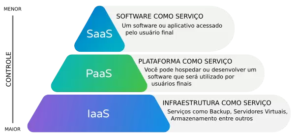

# AWS

AWS significa Amazon Web Services e é a plataforma de computação em nuvem oferecida pela Amazon. A AWS oferece uma ampla gama de serviços em nuvem, incluindo armazenamento, banco de dados, análise, computação, redes, machine learning e muito mais. Esses serviços são disponibilizados aos usuários por meio de diferentes modelos de entrega, incluindo Infraestrutura como Serviço
[IaaS](https://cloud.google.com/learn/what-is-iaas?hl=pt-br) Plataforma como Serviço [PaaS](https://cloud.google.com/learn/what-is-paas?hl=pt-br) e Software como Serviço [SaaS](https://www.salesforce.com/br/saas/). A AWS é considerada uma das principais provedoras de serviços em nuvem do mundo e é amplamente utilizada por empresas de todos os tamanhos.

### AWS CLI

A AWS CLI (Command Line Interface) é uma interface de linha de comando para a AWS (Amazon Web Services) que permite que você gerencie seus recursos da AWS usando comandos em vez de clicar em menus em um console. A AWS CLI está disponível para Windows, macOS e Linux, e é instalada através do pacote de instalação do Python pip.

A AWS CLI fornece acesso direto às APIs públicas dos serviços da AWS. Você pode explorar as capacidades de um serviço com a AWS CLI e desenvolver scripts de shell para gerenciar seus recursos. Além dos comandos de baixo nível equivalentes à API, vários serviços da AWS fornecem personalizações para a AWS CLI. As personalizações podem incluir comandos de nível superior que simplificam o uso de um serviço com uma API complexa."

### AWS SAM

O AWS SAM (Serverless Application Model) é um modelo open source que permite que você desenvolva, testa e implante aplicativos serverless na AWS. O AWS SAM é baseado no AWS CloudFormation, que é um serviço que ajuda a criar e gerenciar infraestrutura na AWS usando arquivos YAML ou JSON.
