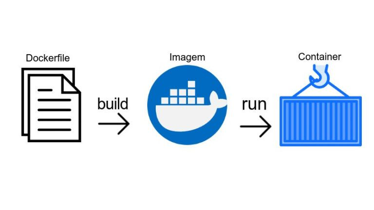

# Docker o que e?

Docker é uma plataforma de software que permite criar, executar e gerenciar aplicativos em contêineres. Os contêineres são uma forma de virtualização em que o aplicativo e todas as suas dependências são empacotados em um único pacote portátil, que pode ser executado em qualquer sistema operacional que suporte o Docker.

Em outras palavras, o Docker permite que você empacote um aplicativo e suas dependências em um contêiner, que pode ser implantado em qualquer sistema que tenha o Docker instalado, sem a necessidade de configurar manualmente o ambiente de execução.

### Para ficar mais claro, vamos dar uma olhada em como o Docker funciona.

O Docker possui um arquivo chamado dockerfile, o qual recebe várias instruções que o Docker usará para criar seu contêiner. Imagine o projeto Born2beroot da 42, e suponha que você precisasse configurá-lo usando apenas um arquivo de texto, o dockerfile é esse arquivo de texto. Com esse arquivo de texto, você criará uma imagem, que é como se fosse uma ISO que você usa para instalar o Debian no projeto, e com essa imagem, você criará um contêiner, que é como se fosse uma máquina virtual. Ele já estará configurado com o que o PDF pede devido às instruções que você deixou no dockerfile. O Wordpress estará rodando e tudo mais. Um sonho, né? Esse é o poder do Docker.

.
### Entre os principais benefícios do Docker estão:

* Portabilidade: os contêineres Docker podem ser executados em qualquer sistema que suporte o Docker,
independentemente do sistema operacional ou hardware subjacente;

* Isolamento: os contêineres Docker oferecem um alto grau de isolamento do sistema operacional hospedeiro,
o que significa que os aplicativos podem ser executados com segurança e sem interferir em outros aplicativos em execução no mesmo sistema;

* Escalabilidade: o Docker facilita a escalabilidade horizontal, permitindo que vários contêineres sejam executados em vários hosts, gerenciados como um único cluster;
Consistência: o Docker oferece uma maneira consistente de empacotar e implantar aplicativos, o que ajuda a garantir que os aplicativos sejam executados de maneira consistente em todos os ambientes.

* Eficiência: os contêineres Docker são geralmente muito leves, pois compartilham recursos com o sistema operacional hospedeiro, o que significa que eles exigem muito menos recursos do que as máquinas virtuais.

* O docker tem um docker hub, que é um repositório de imagens, onde você pode baixar imagens prontas para usar, como o Debian, Wordpress, MySQL, etc. Você também pode criar suas próprias imagens e enviá-las para o docker hub, para que outras pessoas possam usá-las.

### Basico docker

https://www.hostinger.com.br/tutoriais/container-docker?ppc_campaign=google_search_generic_hosting_all&bidkw=defaultkeyword&lo=9101272&gclid=CjwKCAjwx_eiBhBGEiwA15gLN3TXUvfCg5RucW3LOKOTkPBag87NN10Lb_76EEo95jnc3iXjR_d5txoCN1cQAvD_BwE
